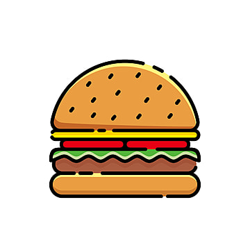

# burgersYum :burger:

## Table of Contents :file_folder:
- [Description](#description)
- [Tests](#tests)
- [Technology](#technology)
- [Contributors](#contributors)
- [Contact](#contact)

## Description :book:

  Do you enjoy looking at and clicking on clip-art of food? Are you tired of stacking high scores by clicking on boring cookies? You've come to the right place! At burgersYum, our mission statement is to bring you the most basic burger clip-art image directly to your cursor. Navigate to our live demo and start eating burgers to your heart's content!

## Tests :bar_chart:

Simply click the following link in order to view the application live thanks to Heroku.

### Live Demo: https://burgers-devoured1.herokuapp.com/

## Technology :computer:

- GitHub & GitHub Pages
- Heroku
- HTML, CSS & Handlebars
- JavaScript & JQuery
- Node & Express

## Contributor :milky_way:

 
Cooper Ahearn - Designer & Developer

## Contact :email:

Connect with & contact directly via LinkedIn:

Cooper Ahearn - <a href="https://www.linkedin.com/in/lcahearn/">LCAhearn</a>